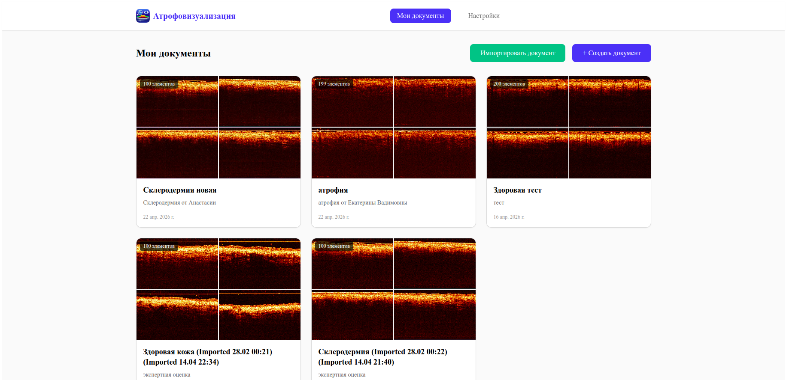
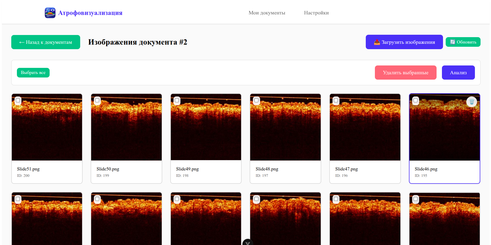
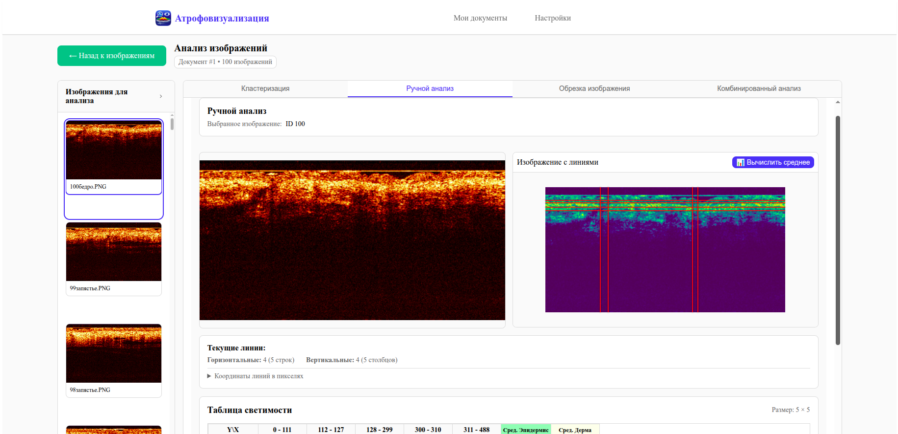
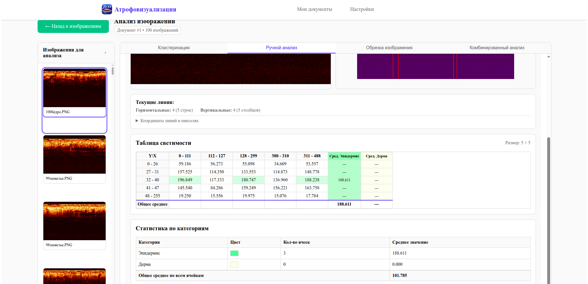
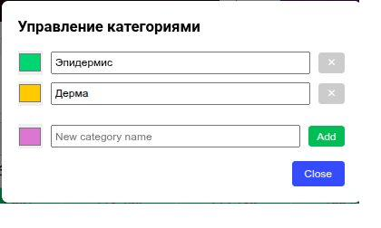

# Атрофовизуализация — Dataset Manager (manual-only)

Настольное приложение для работы с датасетами ОКТ-изображений (оптическая когерентная томография кожи). Эта ветка (`manual-only`) содержит единственный режим анализа — ручную разметку сеткой с вычислением локальной светимости. Автоматическая кластеризация (K-Means), обрезка изображений и комбинированный анализ из этой сборки убраны.

---

## Как устроен проект

Приложение состоит из трёх слоёв, запускаемых совместно.

**Tauri** (Rust) — оболочка десктопного приложения. Встраивает WebView и оборачивает его в нативный процесс ОС. Никакого дополнительного рантайма на машине пользователя не требует. Исполняемый файл при запуске стартует backend и открывает окно с интерфейсом.

**Frontend** (Vue 3 + TypeScript + Vite) — одностраничное приложение, которое работает внутри WebView. Общается с бэкендом через обычный `fetch()` на `localhost:8000`. Состояние UI хранится в Pinia-сторах. Основные экраны:
- `MainMenu.vue` — список датасетов
- `ImageView.vue` — список изображений внутри датасета
- `AnalysisView.vue` — рабочая область, единственная вкладка «Ручной анализ»
- `ManualAnalysis.vue` — разметка сеткой, таблица светимости, статистика по категориям
- `InteractiveImage.vue` — канвас с перетаскиваемыми линиями сетки

**Backend** (FastAPI + Python 3.12) — HTTP-сервер на порту 8000. Хранит метаданные в SQLite через SQLAlchemy (async). Файлы изображений лежат на диске в `uploads/images/{dataset_id}/`. Обработка изображений происходит в памяти через OpenCV и NumPy — промежуточные результаты на диск не пишутся. Структура:
```
app/
├── api/v1/endpoints/
│   ├── IO/          # датасеты, изображения, архивы
│   └── analysis/    # gaussian_blur, calculate_mean_lines
├── service/
│   ├── IO/          # dataset_service, image_service, file_services, archive_service
│   └── computation/ # filter_service, brightness_service
├── models/          # SQLAlchemy ORM: Dataset, Image, Results
└── schemas/         # Pydantic-схемы запросов/ответов
```

Результаты ручного анализа (координаты сетки, значения светимости, категории ячеек) сохраняются в таблицу `Results` как JSON.

Архивирование (экспорт/импорт датасета в ZIP) реализовано через `TaskManager` — задача уходит в фоновый `ThreadPoolExecutor`, статус можно опросить через SSE-endpoint.

---

## Скриншоты

**Список датасетов**



**Список изображений в датасете**



**Разметка сеткой и применение фильтра Гаусса**

> На скриншоте видны вкладки «Кластеризация», «Обрезка изображения» и «Комбинированный анализ» — они взяты из полной версии. В этой сборке в рабочей области присутствует только вкладка **«Ручной анализ»**.



**Таблица светимости и статистика по категориям**



**Управление категориями**



---

## Требования

| Компонент | Версия |
|---|---|
| Python | 3.10 – 3.12 |
| Node.js | 20+ |
| Rust (stable) | последняя стабильная |
| uv | любая |

**Linux — дополнительные системные пакеты:**
```bash
sudo apt-get install -y \
  libwebkit2gtk-4.1-dev \
  build-essential curl wget file \
  libssl-dev \
  libayatana-appindicator3-dev \
  librsvg2-dev
```

---

## Установка из готового релиза

### Windows

1. Скачайте `Atrofovizualizatia.exe` (Inno Setup инсталлятор) из раздела Releases или из артефактов GitHub Actions (`release-windows-installer`).
2. Запустите установщик, следуйте инструкциям.

Или возьмите portable-версию из артефакта `release-windows-portable`:
```
release/windows/
├── dataset-manager.exe   ← исполняемый файл
└── backend/              ← Python-бэкенд
```

Перед первым запуском установите зависимости бэкенда:
```powershell
cd backend
# Установить uv, если нет:
powershell -ExecutionPolicy ByPass -c "irm https://astral.sh/uv/install.ps1 | iex"
uv sync
```

Затем просто запустите `dataset-manager.exe`.

---

### Linux

1. Скачайте артефакт `release-linux` из GitHub Actions.
2. В папке `release/linux/` выполните:

```bash
./install.sh   # установит uv и зависимости backend в .venv
./start.sh     # запустит backend + GUI
```

`start.sh` автоматически запускает backend в фоне перед открытием окна и останавливает его при закрытии приложения.

Запустить только backend (без GUI, для отладки):
```bash
./start-backend-only.sh
# API доступен на http://127.0.0.1:8000
# Swagger UI: http://127.0.0.1:8000/docs
```

---

## Ручная сборка из исходников

### 1. Клонировать репозиторий с подмодулями

```bash
git clone --recurse-submodules <url>
cd tauri-dataset-manager-app
```

### 2. Установить зависимости backend

```bash
cd backend
uv sync
cd ..
```

Если `uv` не установлен:
```bash
curl -LsSf https://astral.sh/uv/install.sh | sh
```

### 3. Linux — сборка через скрипт

```bash
chmod +x scripts/build-tauri.sh scripts/create-release-scripts.sh
cd scripts
./build-tauri.sh          # сборка release-бинарника
./create-release-scripts.sh  # генерирует install.sh / start.sh в release/linux/
```

Результат окажется в:
```
release/linux/
├── dataset-manager        ← бинарник Tauri
├── backend/               ← копия Python-бэкенда
├── install.sh
├── start.sh
└── start-backend-only.sh
```

### 4. Windows — сборка через PowerShell

```powershell
cd scripts
.\build-tauri.ps1
.\create-release-scripts.ps1
```

Для сборки установщика нужен [Inno Setup](https://jrsoftware.org/isinfo.php):
```powershell
iscc scripts/installer.iss
```

Установщик появится в `release/Atrofovizualizatia.exe`.

### 5. Ручная сборка frontend (без скриптов)

```bash
cd frontend
npm install
npm run build          # или: npm run tauri:build
```

Бандл Tauri кладёт артефакты в:
- Linux: `frontend/src-tauri/target/release/bundle/`
- Windows: `frontend/src-tauri/target/release/bundle/nsis/` и `bundle/msi/`

---

## Режим разработки

Запустить backend и frontend отдельно, с hot-reload:

**Backend:**
```bash
cd backend
uv run python main.py
# http://127.0.0.1:8000/docs
```

**Frontend (браузер):**
```bash
cd frontend
npm install
npm run dev       # Vite dev server, http://localhost:5173
```

**Frontend (Tauri dev-режим):**
```bash
cd frontend
npm run tauri:dev
```

---

## Тесты (backend)

```bash
cd backend
.venv/bin/pytest -v
```

С отчётом покрытия:
```bash
.venv/bin/pytest --cov=app --cov-report=term-missing
```

Тесты используют SQLite in-memory, реальный диск не трогают (кроме `test_archive_export_import_flow`, который создаёт временные файлы в `uploads/` и убирает их в `finally`).

Текущее покрытие: **70%**. Хорошо покрыты сервисы вычислений (`brightness_service` 97%, `filter_service` 95%), IO-сервисы и эндпоинты ручного анализа.

---

## CI / GitHub Actions

Файл: `.github/workflows/build-release-simple.yml`

Сборка запускается при push в ветки `manual-only` или `tauri`, а также вручную (`workflow_dispatch`).

| Job | Платформа | Артефакты |
|---|---|---|
| `build-linux` | `ubuntu-latest` | `release-linux` |
| `build-windows` | `windows-latest` | `release-windows-portable`, `release-windows-installer` |

Для Linux: устанавливает системные зависимости webkit2gtk, запускает `build-tauri.sh` + `create-release-scripts.sh`.

Для Windows: запускает `build-tauri.ps1`, затем `create-release-scripts.ps1`, затем собирает установщик через Inno Setup (`iscc scripts/installer.iss`).

---

## Руководство пользователя

### Управление датасетами

На главном экране отображается список датасетов. Кнопка **«+ Создать документ»** открывает форму для нового датасета. Кнопка **«Импортировать документ»** принимает ZIP-архив, экспортированный из этого же приложения.

### Работа с изображениями

После открытия датасета отображается сетка превью. Кнопка **«Загрузить изображения»** открывает диалог выбора файлов (JPEG, PNG, WebP, GIF, до 10 МБ). Для выделения снимков используйте чекбоксы на карточках или **«Выбрать все»**. Выделенные изображения можно удалить или отправить на анализ кнопкой **«Анализ»**.

### Ручной анализ

После перехода в рабочую область откроется единственная вкладка **«Ручной анализ»**.

**Нанесение сетки:**
- Правая кнопка мыши на изображении → контекстное меню → «Добавить горизонтальную линию» / «Добавить вертикальную линию»
- Линии перемещаются перетаскиванием
- Правая кнопка мыши на линии → «Удалить»

**Вычисление светимости:**
- Нажмите **«Вычислить среднее»** — backend применяет фильтр Гаусса и рассчитывает среднюю яркость каждой ячейки по L-каналу цветового пространства Lab
- Результаты появятся в **Таблице светимости**

**Категории:**
- Кнопка **«Управление категориями»** → создайте нужные категории с цветами (например, «Эпидермис», «Дерма»)
- Щёлкните по ячейке таблицы — появится выпадающий список для назначения категории
- Блок **«Статистика по категориям»** показывает количество ячеек и среднюю светимость для каждой категории
- Кнопка **«Сохранить»** фиксирует разметку; при смене изображения без сохранения появится предупреждение

**Экспорт результатов:**
- Кнопка **«Экспорт»** на странице датасета сохраняет ZIP-архив со снимками и результатами всех анализов

### Настройки

Вкладка **«Настройки»** в шапке позволяет переключить тему оформления (светлая / тёмная) и изменить имя пользователя.

---

## Структура репозитория

```
tauri-dataset-manager-app/
├── backend/                  # FastAPI-приложение
│   ├── app/
│   │   ├── api/v1/endpoints/ # IO и analysis эндпоинты
│   │   ├── service/          # бизнес-логика
│   │   ├── models/           # SQLAlchemy ORM
│   │   └── schemas/          # Pydantic
│   ├── tests/                # pytest
│   ├── uploads/              # хранилище файлов (создаётся при запуске)
│   ├── main.py
│   └── pyproject.toml
├── frontend/                 # Vue 3 + Tauri
│   ├── src/
│   │   ├── api/              # fetch-обёртки (datasets, images, manual)
│   │   ├── components/       # Vue-компоненты
│   │   ├── views/            # страницы (маршруты)
│   │   └── stores/           # Pinia
│   ├── src-tauri/            # Rust/Tauri конфигурация и код
│   └── package.json
├── scripts/                  # build-tauri.sh/.ps1, installer.iss, ...
├── docs/                     # скриншоты для README
└── .github/workflows/        # CI
```

---

## API

После запуска backend документация доступна на:

- Swagger UI: `http://127.0.0.1:8000/docs`
- ReDoc: `http://127.0.0.1:8000/redoc`

Все маршруты начинаются с `/api/v1`. Основные группы:

| Префикс | Описание |
|---|---|
| `/api/v1/IO/dataset` | CRUD датасетов |
| `/api/v1/IO/image` | загрузка, скачивание, удаление, инфо по изображению |
| `/api/v1/IO/archive` | экспорт/импорт датасета ZIP |
| `/api/v1/analysis/manual` | фильтр Гаусса, расчёт светимости по сетке |
| `/api/v1/tasks` | статус фоновых задач |
