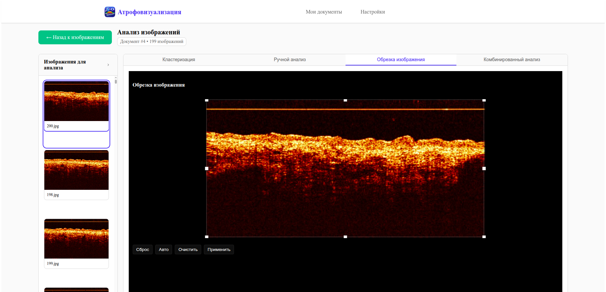
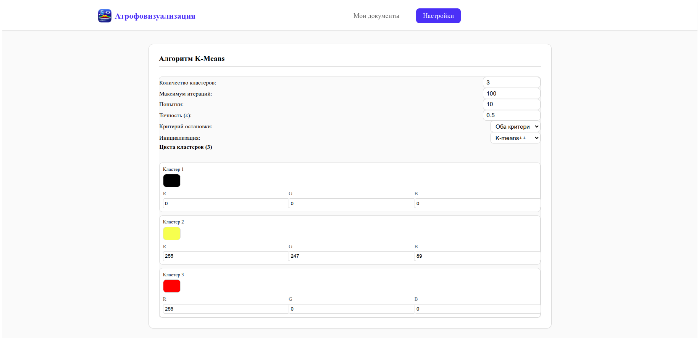
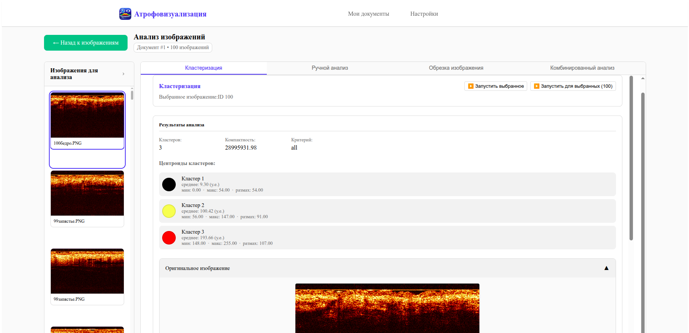
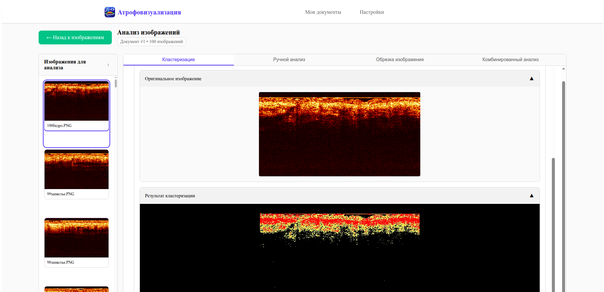
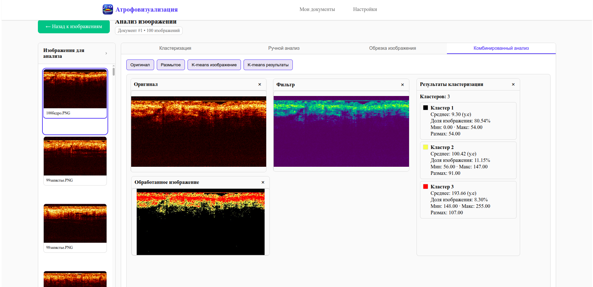
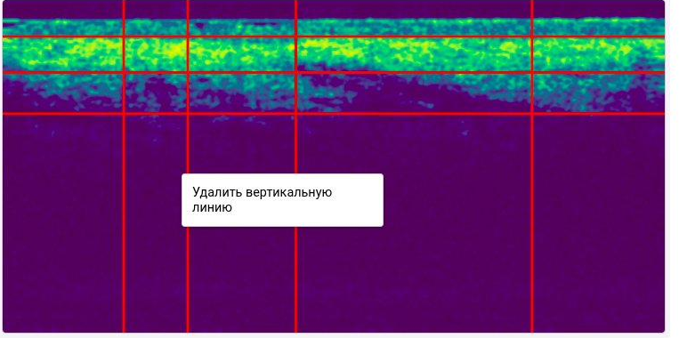

# Атрофовизуализация — Dataset Manager

Настольное приложение для работы с датасетами ОКТ-изображений (оптическая когерентная томография кожи). Позволяет загружать снимки, организовывать их в датасеты, выполнять ручную разметку сеткой, автоматическую кластеризацию методом K-средних, обрезку изображений и комбинированный анализ.

---

## Как устроен проект

Приложение состоит из трёх слоёв, запускаемых совместно.

**Tauri** (Rust) — оболочка десктопного приложения. Встраивает WebView и оборачивает его в нативный процесс ОС. Никакого дополнительного рантайма на машине пользователя не требует. Исполняемый файл при запуске стартует backend и открывает окно с интерфейсом.

**Frontend** (Vue 3 + TypeScript + Vite) — одностраничное приложение, которое работает внутри WebView. Общается с бэкендом через обычный `fetch()` на `localhost:8000`. Состояние UI хранится в Pinia-сторах. Основные экраны:
- `MainMenu.vue` — список датасетов
- `ImageView.vue` — список изображений внутри датасета
- `AnalysisView.vue` — рабочая область анализа
- `ManualAnalysis.vue` — разметка сеткой, таблица светимости, статистика по категориям
- `InteractiveImage.vue` — канвас с перетаскиваемыми линиями сетки
- `KMeans.vue` — настройка и результаты кластеризации
- `CropView.vue` — обрезка изображения
- `ComboAnalysis.vue` — комбинированный анализ

**Backend** (FastAPI + Python 3.12) — HTTP-сервер на порту 8000. Хранит метаданные в SQLite через SQLAlchemy (async). Файлы изображений лежат на диске в `uploads/images/{dataset_id}/`. Обработка изображений происходит в памяти через OpenCV и NumPy — промежуточные результаты на диск не пишутся. Структура:
```
app/
├── api/v1/endpoints/
│   ├── IO/          # датасеты, изображения, архивы
│   └── analysis/    # gaussian_blur, calculate_mean_lines, k_means, crop
├── service/
│   ├── IO/          # dataset_service, image_service, file_services, archive_service
│   └── computation/ # filter_service, brightness_service, cluster_service, crop_service
├── models/          # SQLAlchemy ORM: Dataset, Image, Results
└── schemas/         # Pydantic-схемы запросов/ответов
```

Результаты ручного анализа (координаты сетки, значения светимости, категории ячеек) и кластеризации сохраняются в таблицу `Results` как JSON.

Архивирование (экспорт/импорт датасета в ZIP) реализовано через `TaskManager` — задача уходит в фоновый `ThreadPoolExecutor`, статус можно опросить через SSE-endpoint.

---

## Скриншоты

**Список датасетов**


**Список изображений в датасете**


**Разметка сеткой и применение фильтра Гаусса**


**Таблица светимости и статистика по категориям**


**Обрезка изображения**



**Настройка параметров K-средних**



**Результаты кластеризации**



**Визуализация сегментации**



**Комбинированный анализ**



---

## Установка из готового релиза

### Windows

В папке с дистрибутивом находится файл `Atrofovizualizatia.exe` — установщик на базе Inno Setup. Установщик автоматически разворачивает все необходимые зависимости, включая Python-окружение бэкенда через `uv`.

1. Запустите `Atrofovizualizatia.exe`, следуйте инструкциям установщика.
2. После завершения установки запустите приложение из меню Пуск или с рабочего стола.

---

### Linux

В папке с дистрибутивом находятся скрипты `install.sh` и `start.sh`. `install.sh` при необходимости сам устанавливает `uv` и разворачивает Python-окружение бэкенда.

1. Откройте папку дистрибутива в терминале и выполните:

```bash
./install.sh   # устанавливает uv (если нет) и зависимости бэкенда
./start.sh     # запускает бэкенд + приложение
```

`start.sh` запускает бэкенд в фоне перед открытием окна и останавливает его при закрытии приложения.

Запустить только бэкенд (для отладки):
```bash
./start-backend-only.sh
# API: http://127.0.0.1:8000
# Swagger UI: http://127.0.0.1:8000/docs
```

---

## Ручная сборка из исходников

### 1. Клонировать репозиторий с подмодулями

```bash
git clone --recurse-submodules <url>
cd tauri-dataset-manager-app
```

### 2. Установить зависимости backend

```bash
cd backend
uv sync
cd ..
```

Если `uv` не установлен:
```bash
curl -LsSf https://astral.sh/uv/install.sh | sh
```

### 3. Linux — сборка через скрипт

```bash
chmod +x scripts/build-tauri.sh scripts/create-release-scripts.sh
cd scripts
./build-tauri.sh          # сборка release-бинарника
./create-release-scripts.sh  # генерирует install.sh / start.sh в release/linux/
```

Результат окажется в:
```
release/linux/
├── dataset-manager        ← бинарник Tauri
├── backend/               ← копия Python-бэкенда
├── install.sh
├── start.sh
└── start-backend-only.sh
```

### 4. Windows — сборка через PowerShell

```powershell
cd scripts
.\build-tauri.ps1
.\create-release-scripts.ps1
```

Для сборки установщика нужен [Inno Setup](https://jrsoftware.org/isinfo.php):
```powershell
iscc scripts/installer.iss
```

Установщик появится в `release/Atrofovizualizatia.exe`.

### 5. Ручная сборка frontend (без скриптов)

```bash
cd frontend
npm install
npm run build          # или: npm run tauri:build
```

Бандл Tauri кладёт артефакты в:
- Linux: `frontend/src-tauri/target/release/bundle/`
- Windows: `frontend/src-tauri/target/release/bundle/nsis/` и `bundle/msi/`

---

## Режим разработки

Запустить backend и frontend отдельно, с hot-reload:

**Backend:**
```bash
cd backend
uv run python main.py
# http://127.0.0.1:8000/docs
```

**Frontend (браузер):**
```bash
cd frontend
npm install
npm run dev       # Vite dev server, http://localhost:5173
```

**Frontend (Tauri dev-режим):**
```bash
cd frontend
npm run tauri:dev
```

---

## Тесты (backend)

```bash
cd backend
uv run pytest -v
```

С отчётом покрытия:
```bash
uv run pytest --cov=app --cov-report=term-missing
```

Тесты используют SQLite in-memory, реальный диск не трогают (кроме `test_archive_export_import_flow`, который создаёт временные файлы в `uploads/` и убирает их в `finally`).

---

## CI / GitHub Actions

Файл: `.github/workflows/build-release-simple.yml`

Сборка запускается при push в ветку `tauri`, а также вручную (`workflow_dispatch`).

| Job | Платформа | Артефакты |
|---|---|---|
| `build-linux` | `ubuntu-latest` | `release-linux` |
| `build-windows` | `windows-latest` | `release-windows-portable`, `release-windows-installer` |

Для Linux: устанавливает системные зависимости webkit2gtk, запускает `build-tauri.sh` + `create-release-scripts.sh`.

Для Windows: запускает `build-tauri.ps1`, затем `create-release-scripts.ps1`, затем собирает установщик через Inno Setup (`iscc scripts/installer.iss`).

---

## Руководство пользователя

### 1. Управление датасетами

Главное окно (кнопка **«Мои датасеты»** в шапке) отображает карточки документов с названием, описанием, датой создания и количеством изображений.

- **«+ Создать документ»** — открывает форму, где нужно ввести название и описание нового датасета.
- **«Импортировать документ»** — принимает ZIP-архив, ранее экспортированный из приложения; создаёт новый датасет со всеми изображениями и результатами анализа.

### 2. Работа со списком изображений

После нажатия на карточку датасета открывается список загруженных снимков.

- **«Загрузить изображения»** — открывает диалог выбора файлов (JPEG, PNG, WebP, GIF, до 10 МБ). Можно выбрать несколько файлов сразу.
- **«Обновить»** — обновляет список без перезагрузки страницы.
- Чекбоксы на карточках или кнопка **«Выбрать все»** — выделяют снимки для дальнейших действий.
- **«Удалить выбранные»** — удаляет отмеченные изображения вместе с файлами на диске.
- **«Анализ»** — переходит в рабочую область для выделенных снимков.
- **«Экспорт»** — формирует ZIP-архив со всеми снимками и результатами анализа.

### 3. Рабочая область

Слева — панель со списком выбранных изображений для быстрого переключения между ними. Щелчок по миниатюре загружает нужный снимок в область анализа. Основная область разделена на четыре вкладки: **Кластеризация**, **Ручной анализ**, **Обрезка изображения**, **Комбинированный анализ**.

### 4. Обрезка изображения


Вкладка **«Обрезка изображения»** позволяет выделить область для кластеризации, отсекая артефакты интерфейса прибора или пустые зоны.

- **«Авто»** — автоматически рассчитывает границы по содержимому снимка.
- Потяните за маркеры рамки выделения для ручной корректировки.
- **«Применить»** — сохраняет параметры обрезки.
- **«Очистить»** — убирает текущий выбор.
- **«Сброс»** — отменяет все изменения.

### 5. Ручной анализ


Инструмент предназначен для нанесения сетки на изображение и расчёта средней светимости в каждой ячейке.

**Нанесение линий:**

1. Нажмите **правой кнопкой мыши** на свободной области изображения — откроется контекстное меню.
2. Выберите **«Добавить горизонтальную линию»** или **«Добавить вертикальную линию»**.
3. Перетащите линию мышью, совместив её с границей анатомической структуры на снимке.
4. Чтобы удалить ошибочно добавленную линию — нажмите на неё **правой кнопкой мыши** и выберите **«Удалить»**.



Текущее количество линий и координаты в пикселях отображаются в блоке **«Текущие линии»** под изображением.

**Вычисление светимости:**

Нажмите **«Вычислить среднее»**. Сервер применяет сглаживающий фильтр Гаусса и рассчитывает среднюю яркость каждой ячейки по L-каналу цветового пространства Lab. Результаты появляются в **Таблице светимости**.


**Назначение категорий:**

1. Нажмите **«Управление категориями»** и создайте нужные категории, задав им название и цвет (например, «Эпидермис» — зелёный, «Дерма» — жёлтый).
2. Щёлкните по ячейке в **Таблице светимости** — появится выпадающий список для выбора категории. Ячейка окрасится в цвет категории.
3. Блок **«Статистика по категориям»** автоматически показывает количество ячеек и среднюю светимость для каждой назначенной категории.

**Сохранение:**

- Кнопка **«Сохранить»** — фиксирует текущую разметку (положение линий и назначенные категории) в базе данных.
- При попытке переключиться на другое изображение без сохранения появится предупреждение с кнопками **«Сохранить»** и **«Отменить»**.

### 6. Автоматический анализ методом K-средних

**Настройка параметров:**


В панели настройки задаются гиперпараметры алгоритма:

- **Количество кластеров** (по умолчанию 3)
- **Максимум итераций** (по умолчанию 100)
- **Попытки** (по умолчанию 10)
- **Точность (ε)** (по умолчанию 0,5)
- **Критерий остановки** — по ε, по числу итераций или по обоим
- **Инициализация** — K-means++ или случайная
- **Цвета кластеров** — по умолчанию чёрный, жёлтый, красный

**Запуск:**

- **«Запустить выбранное»** — анализ текущего изображения.
- **«Запустить для выбранных»** — пакетная обработка всех выбранных снимков датасета.

**Результаты:**


В верхней части вкладки выводится статистика: суммарная внутрикластерная дисперсия, использованный критерий остановки и характеристики центроидов (среднее, минимум, максимум, размах) для каждого кластера.


В нижней части — исходное ОКТ-изображение и сегментированная маска, на которой ткани окрашены в цвета соответствующих кластеров.

### 7. Комбинированный анализ


Вкладка **«Комбинированный анализ»** объединяет на одном экране результаты разных этапов обработки:

- Оригинал снимка
- Изображение после применения сглаживающего фильтра (в псевдоцветовой палитре)
- Результат K-средних
- Числовые результаты кластеризации с долевым соотношением (в процентах) каждого кластера на снимке

### 8. Настройки

Вкладка **«Настройки»** в шапке позволяет переключить тему оформления (светлая / тёмная) и изменить отображаемое имя пользователя.

---

## Структура репозитория

```
tauri-dataset-manager-app/
├── backend/                  # FastAPI-приложение (подмодуль)
│   ├── app/
│   │   ├── api/v1/endpoints/ # IO и analysis эндпоинты
│   │   ├── service/          # бизнес-логика
│   │   ├── models/           # SQLAlchemy ORM
│   │   └── schemas/          # Pydantic
│   ├── tests/                # pytest
│   ├── uploads/              # хранилище файлов (создаётся при запуске)
│   ├── main.py
│   └── pyproject.toml
├── frontend/                 # Vue 3 + Tauri (подмодуль)
│   ├── src/
│   │   ├── api/              # fetch-обёртки (datasets, images, manual, kmeans)
│   │   ├── components/       # Vue-компоненты
│   │   ├── views/            # страницы (маршруты)
│   │   └── stores/           # Pinia
│   ├── src-tauri/            # Rust/Tauri конфигурация и код
│   └── package.json
├── scripts/                  # build-tauri.sh/.ps1, installer.iss, ...
├── docs/                     # скриншоты для README
└── .github/workflows/        # CI
```

---

## API

После запуска backend документация доступна на:

- Swagger UI: `http://127.0.0.1:8000/docs`
- ReDoc: `http://127.0.0.1:8000/redoc`

Все маршруты начинаются с `/api/v1`. Основные группы:

| Префикс | Описание |
|---|---|
| `/api/v1/IO/dataset` | CRUD датасетов |
| `/api/v1/IO/image` | загрузка, скачивание, удаление, инфо по изображению |
| `/api/v1/IO/archive` | экспорт/импорт датасета ZIP |
| `/api/v1/analysis/manual` | фильтр Гаусса, расчёт светимости по сетке |
| `/api/v1/analysis/kmeans` | кластеризация методом K-средних |
| `/api/v1/analysis/crop` | обрезка изображения |
| `/api/v1/tasks` | статус фоновых задач |
